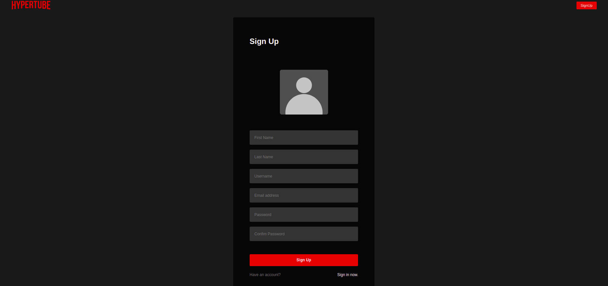
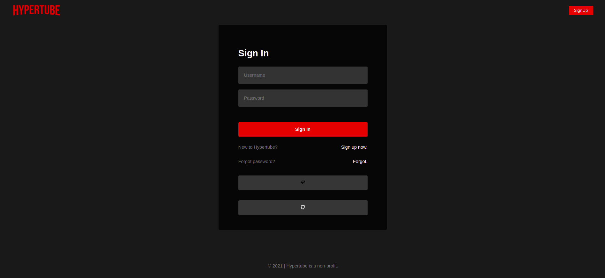
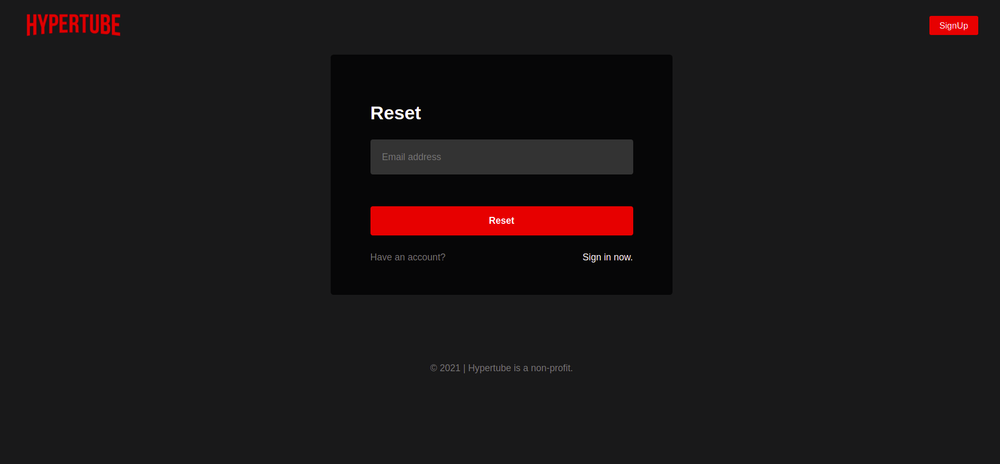
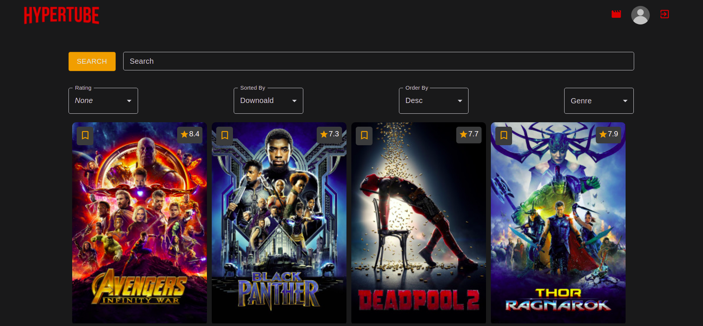
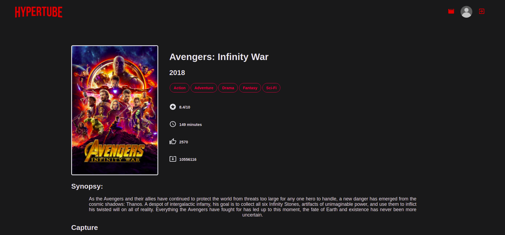
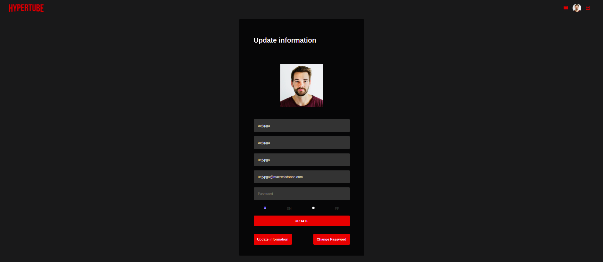
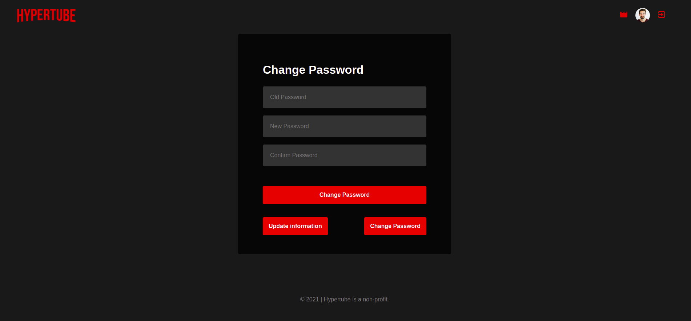

# HyperTube

EN:
This project offers you to create a web application allowing a user to search and view videos. The player will be directly integrated into the site, and the videos will be downloaded through the BitTorrent protocol.

FR:
Ce projet vous propose de créer une application web permettant à un utilisateur de rechercher et visionner des vidéos. Le lecteur sera directement intégré au site, et les vidéos seront téléchargées au travers du protocole BitTorrent

### Stack

* Node JS (Express)
* React JS
* Styled Components
* Material UI Front libraries
* MySQL
* JSON web tokens
* Axios for API requests
* Docker

## How to launch

```bash
docker-compose build
docker-compose up
```

## Screenshots

</br>
</br>
</br>
</br>
</br>
</br>
</br>


## License
[MIT](https://choosealicense.com/licenses/mit/)

